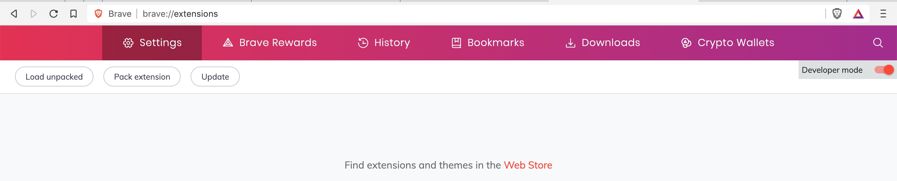
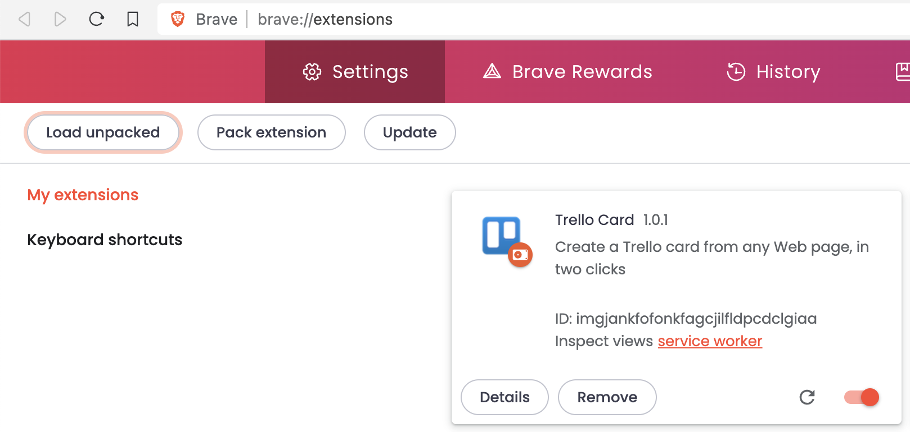
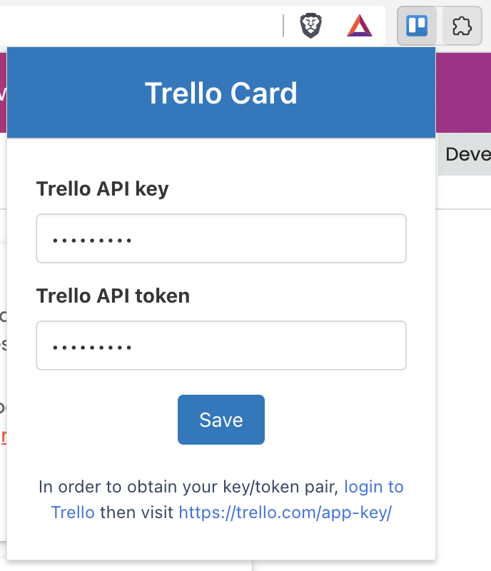
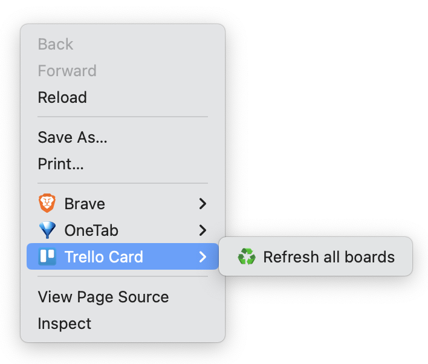
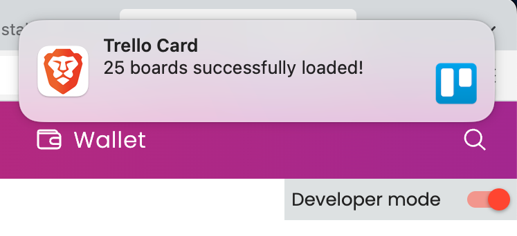
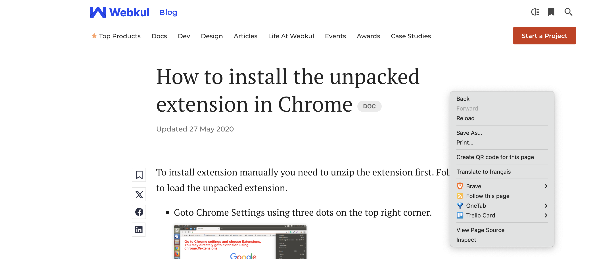
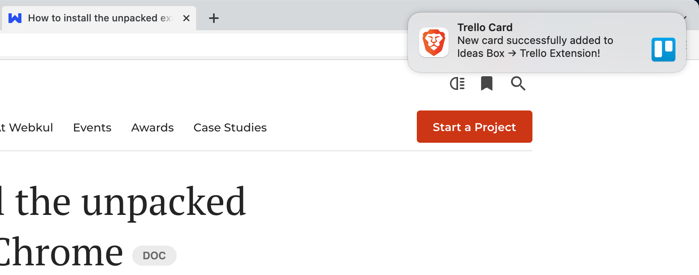

# A Trello extension for Brave and Chrome

Create a Trello card from any Web page, in two clicks. Including metadata (title, description) and a cover image.

## Installation

As the extension is not published in Chrome Web store, the installation is a bit more tedious...

In a terminal, clone the repository:

```shell
git clone https://github.com/mawrkus/brave-chrome-trello-extension.git
```

Or download the code via the "Code" > "Download ZIP" GitHub button and unzip it in a "brave-chrome-trello-extension" folder on your computer.

In Brave/Chrome:

- Go to this "url": [chrome://extensions](chrome://extensions) (or [brave://extensions](brave://extensions))
- Activate the "Developer mode" and click on "Load unpacked":
  

- Go to the folder where you've cloned the extension and click "Select". The extension is now installed...
  

- ...and its icon appears in the browser's toolbar:
  <br />

## Usage

First you'll need an API key and token.
In order to obtain them, <a href="https://trello.com/login" target="_blank">login to Trello</a> then visit <a href="https://trello.com/app-key/" target="_blank">https://trello.com/app-key/</a>

Once obtained your API key and token, click on the extension icon in the browser's toolbar to add them:


After saving, right-click on the page to open the contextual menu and click on "Refresh all boards":


After some time, you should be notified that your boards were loaded properly:


Now you can right-click on any page and choose the board/list you want the new card to be added to:


_Et voilà!_

