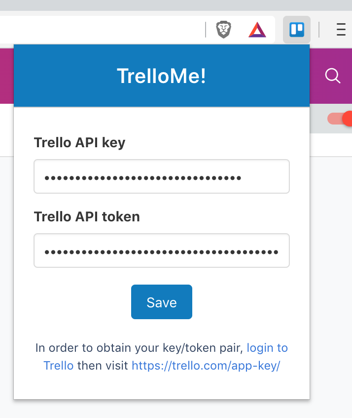
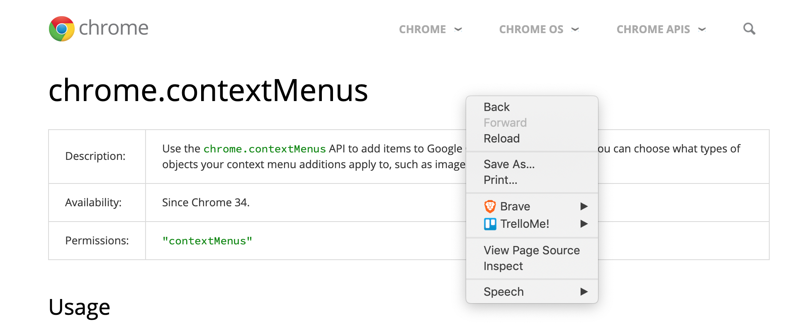
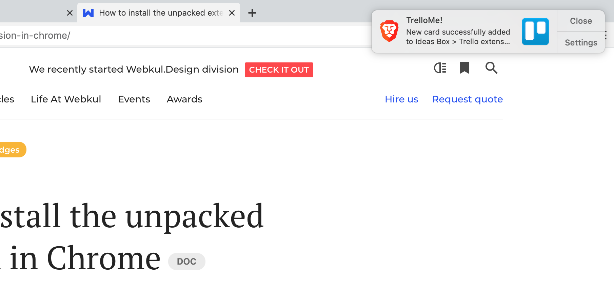

# A Trello extension for Brave and Chrome

*Creating new Trello cards from Web pages made easy.*

## Installation

As the extension is not published in Chrome Web store, the installation is a bit more tedious...

- In a terminal:

  ```shell
  git clone https://github.com/mawrkus/brave-chrome-trello-extension.git
  ```

- In Brave/Chrome, go to this "url": [chrome://extensions](chrome://extensions)
- Click on "Load unpacked"
- Go to the folder where you've cloned the extension and click "Select"
- All good! You should see the extension icon in Brave's toolbar


Detailed info: https://webkul.com/blog/how-to-install-the-unpacked-extension-in-chrome/

## Usage

First you'll need an API key and token.
In order to obtain them, <a href="https://trello.com/login" target="_blank">login to Trello</a> then visit <a href="https://trello.com/app-key/" target="_blank">https://trello.com/app-key/</a>

Click on the extension icon in Brave's toolbar to enter them:


Once saved, you should be notified that your boards were loaded properly:


Right-click on any page and choose the board/list you want the new card to be added to:


Et voilà:

